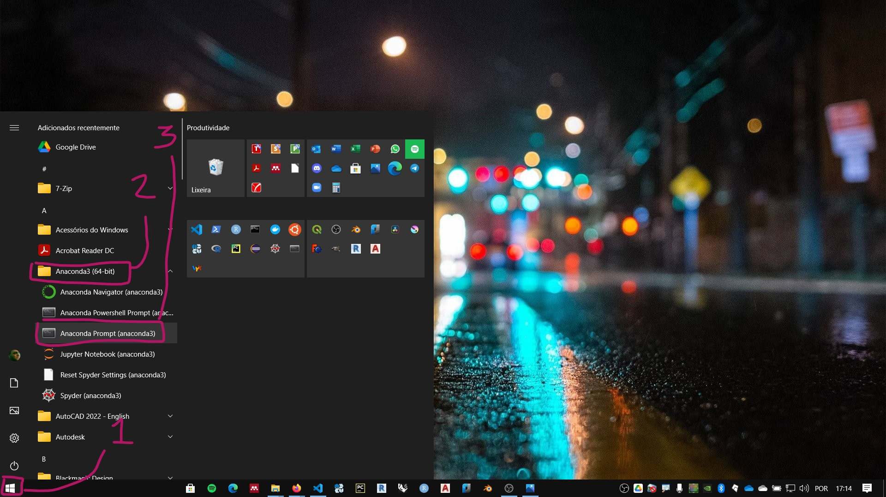
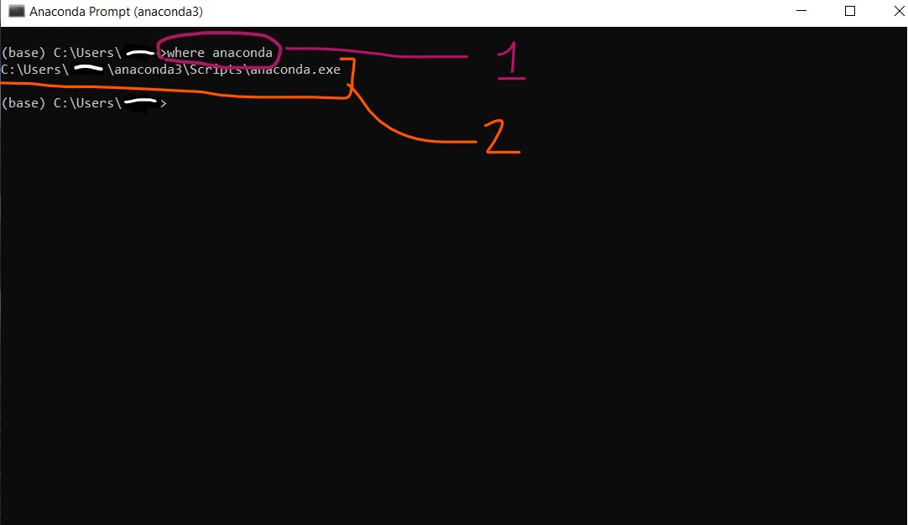

# Encontrando a pasta de instalação da distribuição Anaconda.
  
- No menu iniciar, na pasta Anaconda3, clique na opção **Anaconda prompt (anaconda3)**

!!! warning Atenção
    Esse comando não funciona no **Anaconda powershell prompt (anaconda3)**



- Na tela do  **prompt**, digite ```where anaconda```. O comando mostar o caminho para o arquivo anaconda.exe.


   
## Montando o caminho do ambiente IDLE

- Use o caminho mostrado pelo comando até a pasta ```...\anaconda3\``` e complete o caminho com ```Lib\idlelib\idle.pyw``` ou ```\Scripts\idle.exe```
