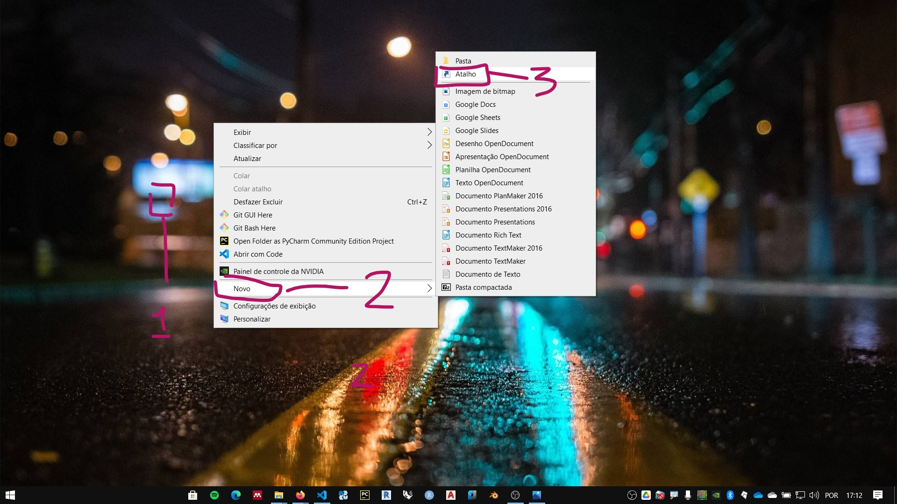
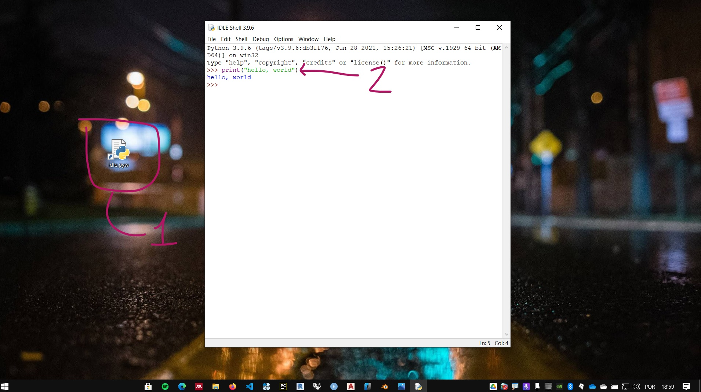

# Instalação do Python

A distribuição oficial do CPython pode ser encontrada na página da Python Foundation, [Python.org](https://www.python.org/). Embora este seja um material rico sobre a linguagem, neste curso vamos utilizar a distribuição **Anaconda**.

**Anaconda** é uma distribuição do Python orientada para programação científica e análise de dados. A página oficial da distribuição é [anaconda.com](https://www.anaconda.com)


 O instalador da versão individual (gratuita) pode ser baixada no link: [https://www.anaconda.com/products/individual](https://www.anaconda.com/products/individual). Ou pelo menu **Products**, opção **Individual Edition**.


Clique no link de download para baixar o instalador. Certifique-se de baixar o executável compatível com seu sistema operacional.


## Instalação no Windows

Siga as instruções:

1. Execute o instalador
    
1. Concorde com os termos do serviço. clique em **I Agree**.
    
2. Instalar para o usuário atual do computador ou para todos os usuários. O padrão é apenas para o usuário atual **(just me)**. Escolha sua opção e clique em **Next**.
    
3. Escolha a pasta da instalação e clique em **Next**.
    
4. Opções de instalação. Não é recomendado marcar a primeira opção.Pode-se marcar a segunda opção. clique em instalar e aguarde o final do processo. 
    

## Preparando o ambiente no Windows

!!! note Nota
    As instruções abaixo são baseadas no Windows 10.

### IDLE

O IDLE é uma interface básica para programação do CPython. Idle, em inglês significa ocioso. Em computação pode significar que o processador já executou as instruções e aguarda novos comandos. Levando em consideração:

1. o senso de humor dos criadores do Python,
2. e que o nome da linguagem é uma homenagem ao grupo de humor [Monty Python](https://en.wikipedia.org/wiki/Monty_Python)

O nome deste ambiente pode ser uma homenagem a um dos membros do grupo, o ator, músico, escritor e comediante [Eric Idle](https://en.wikipedia.org/wiki/Eric_Idle).

A simplicidade da interface IDLE é uma vantagem quando se esta começando a programar pela linguagem Python. Podemos focar na lógica de programação e características da linguagem em uma interface sem muitas distrações ou necessidades de configuração.


#### Para acessar a interface IDLE da instalação Anaconda no Windows:

##### Criando um atalho para o IDLE

1. Clique com o botão direito na área de trabalho
   

2. coloque o caminho do atalho conforme instruções abaixo:
   

   - Quando a distribuição conda é instalada apenas para o usuário atual **(just me)** use:<br> ```%USERPROFILE%\anaconda3\Scripts\idle.exe``` <br> ou <br> ```%USERPROFILE%\anaconda3\Lib\idlelib\idle.pyw```<br><br>


   - Quando a distribuição conda é instalada para todos os usuários **(all users)** <span style="color: red;"> (conferir caminho) </span>:<br> ```%PROGRAMDATA%\anaconda3\Scripts\idle.exe``` <br> ou <br> ```%PROGRAMDATA%\anaconda3\Lib\idlelib\idle.pyw``` <br><br>


    !!! warning
         Caso tenha instalado a distribuição em um outro caminho e não saiba qual veja as instruções no link:
         [Encontrando a pasta de instalação da distribuição Anaconda](./extra_config.md)

3.  Copie o caminho para o IDLE e clique em avançar
    

4. Clique em concluir

    

5. Execute o atalho e, na tela do IDLE, digite: ```print("hello, world")``` e aperte **enter**

    

## Instalando o gerenciador de pacotes Mamba (opcional)


No **prompt**, digite:

``` conda install mamba -n base -c conda-forge ```

Aperte a tecla enter e siga as instruções de instalação


#### FIM
